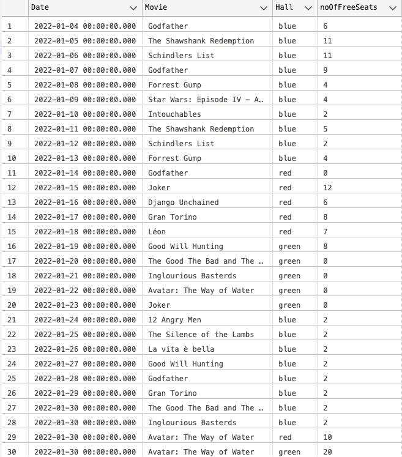

# Baza danych kina - Dawid Bania i Miłosz Wielgus

## Wstęp - o projekcie

Podstawowym założeniem projektu było umożliwienie gromadzenia danych o salach kinowych,
seansach filmowych oraz umożliwienie generowania raportów dotyczących sprzedaży biletów jak i przychodów dla każdego filmu.

Tak zaprojektowana baza danych może zostać wykorzystana jako narzędzie do wyprowadzania statystyk związanych z funkcjonowaniem kina
jak i jako wewnętrzna warstwa aplikacji np. webowej danego kina - wyświetlanie aktualnych seansów, dostępności miejsc czy wyszukiwania filmów
z konkretnymi parametrami (aktorzy, gatunki, rok wydania).

Głównym fundamentem podczas projektowania bazy danych było założenie prostoty i przejrzystości przechowywanych danych i maksymalnym zmniejszeniem ich redundantności w poszczególnych tabelach.

## Pielęgnacja bazy danych

Standardowy dzień w kinie wiąże się z potrzebą przetwarzania dużej ilości danych. Każdego dnia dochodzi do kilkuset transakcji, uwzględniając w tym nieuniknione zwroty czy reklamacje, rezerwacje miejsc i obsługę listy pokazów filmowych. 

Utrata danych oznaczałaby konieczność ponownego wprowadzenia tysięcy rekordów co może okazać się problematyczne ze względu na liczne powiązania pomiędzy tabelami. 

W takich warunkach koniecznym jest tworzenie kopii zapasowych bazy, zwłaszcza w okresach "zwiększonego natężenia" takich jak święta, premier blockbusterowych filmów. Dodatkowym pragmatycznym rozwiązaniem jest przygotowywanie pełnej kopii bazy - na przykład na koniec tygodnia.

## Tabele

1. Movies - tabela przechowująca informacje o filmie, na przykład takie jak: *tytuł*, *gatunek*, *reżyser* czy *aktualny stan wyświetlania filmu*.
2. Showings - tabela przechowująca informacje o seansach, zawierająca informacje o *cenie biletów*, *dacie pokazu* czy *sali*.
3. Reservations - tabela przechowująca informacje o rezerwacjach, zawierająca kluczowe: *numer rezerwowanego miejsca*, *dane klienta*, *rodzaj biletu* czy *datę transakcji*.
4. Seats - tabela z siedzeniami dla sal kinowych.
5. Halls - tabela z salami kinowymi, posiadająca informacje o *pojemności sali* jak i jej *nazwie*.
6. Clients - tabela z danymi dotyczących klienta, zawierająca informacje takie jak *imię*, *nazwisko* i *dane kontaktowe*.
7. Employees - tabela z danymi związanymi z pracownikami kina, zawierająca między innymi: *imię*, *nazwisko*, *numerem stanowiska*
8. Posts - tabela ze szczegółowymi danymi dla konkretnego stanowiska, czyli posiadająca *nazwę stanowiska*, *stawkę godzinową*
9. Shifts - tabela z informacjami dotyczącymi odbywanych przez pracowników zmian w kinie czyli *początkiem* i *końcem* zmiany, jak i *numerem pracownika*.
10. Products - tabela z danymi o produktach sprzedawanych przez kino, zawierająca *cenę sprzedaży*, *cenę kupna* czy *aktualną ilość towaru w magazynie*.
11. Orders - tabela posiadająca informacje dotyczące zamówień towarów do kina, a zatem z *datą zamówienia*, *ilością*, *numerem produktu*, czy *statusie zamówienia*.
12. TransactionList - tabela danych obejmująca informacje związane z transakcjami, czyli produktami sprzedawanymi przez kino, a więc zawiera *numer pracownika*, *date transakcji*, *numer sprzedawanego produktu* i *jego cenę* czy *ilość*.
13. Studios - tabela przechowująca informacje o wytwórniach, dystrybutorach filmów, które wyświetlamy w kinie, czyli *nazwę studia* i *kontakt do niego*.
14. Licenses - tabela przechowująca dane o zakupionych licencjach na wyświetlanie filmów, obejmująca *cenę*, *początek* i *koniec* licencji, *numer filmu* czy *numer studia*.
15. Actors - tabela z danymi dotyczącymi aktorów, którzy pojawiają się w filmach wyświetlanych przez kino, zawierająca *imię* i *nazwisko* aktora, *datę urodzin* czy *kraj pochodzenia*.
16. Cast - tabela wiążąca *aktorów* z *filmami* w postaci obsady filmu, zawierająca *numer filmu*, *numer aktora* oraz *rolę* przez niego graną. 

## Schemat bazy danych


## Diagram ER


## Widoki
Utworzone widoki pozwalają na wyświetlanie uogólnionych danych, które
nie wymagają parametryzacji do wyliczenia.


```sql
----------------------------------------------------------------------------
--1 view displaying viewers who agreed to receive the newsletter
GO
CREATE View [ClientsWithNewsletter] AS
    SELECT * FROM Clients C
    WHERE C.newsletter = 1
GO
----------------------------------------------------------------------------
```


```sql
----------------------------------------------------------------------------
--2 view displaying most watched movies in our cinema
GO
CREATE View [MostViewedFilms] AS
    SELECT TOP 3 WITH TIES M.movieTitle, COUNT(R.reservationID) as [total viewers] FROM Reservations R
    JOIN Showings S ON (R.showingID = S.showingID)
    JOIN Movies M ON(M.movieID = S.movieID)
    GROUP BY M.movieTitle ORDER BY COUNT(R.reservationID) DESC
GO
----------------------------------------------------------------------------
```


```sql
--3 view displaying contacts to studios for which we have films with expired licenses
GO
CREATE View [ContactToStudiosForNewLicenses] AS
    SELECT M.movieTitle, S.studioName, S.contactInfo, L.price FROM Licenses L
    JOIN Movies M ON(L.movieID = M.movieID)
    JOIN Studios S ON(S.studioID = L.movieID)
    WHERE GETDATE() >= (SELECT finish FROM Licenses WHERE Licenses.movieID = L.movieID)
GO
----------------------------------------------------------------------------
```


```sql
----------------------------------------------------------------------------
--4 view displaying viewers who have watched more than half of our showings
GO
CREATE View [MostLoyalClients] AS
    SELECT C.name, C.surname, C.email, C.phoneNumber, C.newsletter, COUNT(DISTINCT R.showingID) AS [films watched]
    FROM Clients C
    JOIN Reservations R ON(C.clientID = R.clientID)
    GROUP BY C.name, C.surname, C.email, C.phoneNumber, C.newsletter
    HAVING COUNT(DISTINCT R.showingID) >= ROUND((SELECT COUNT(*) FROM Showings)/2, 0)
GO
----------------------------------------------------------------------------
```


## Funkcje
Zaprojektowane funkcje wykorzystywane są do wyświetlania konkretnych danych, z reguły związanych
z obrotami kina czy aktualnym repertuarem. 


```sql
----------------------------------------------------------------------------
--1 function displaying revenue from showings
--  arguments of the function are not mandatory value-wise (NULL is accepted)
--  passed format is [YY, MM, DD] e.g. [2022, 1, 1] or [2022, NULL, NULL]
DROP FUNCTION IF EXISTS dbo.incomeFromMovies;
GO
CREATE FUNCTION incomeFromMovies (@year INT, @month INT, @day INT)
RETURNS @IncomeFromMovies TABLE
(
    [movieTitle] NVARCHAR(50),
    [ticketSales] INT,
    [date] DATE
)
AS
BEGIN
    INSERT INTO @IncomeFromMovies
    SELECT M.movieTitle,
    (SELECT COUNT(*) 
        FROM Reservations 
        WHERE showingID = R.showingID AND ticketType = 'R' AND ((@year IS NOT NULL AND YEAR(S.[date]) = @year) OR @year IS NULL) 
                                                           AND ((@month IS NOT NULL AND MONTH(S.[date]) = @month) OR @month IS NULL)
                                                           AND ((@day IS NOT NULL AND DAY(S.[date]) = @day) OR @day IS NULL)) * S.reducedPrice 
    +
    (SELECT COUNT(*) 
        FROM Reservations 
        WHERE showingID = R.showingID AND ticketType = 'S' AND ((@year IS NOT NULL AND YEAR(S.[date]) = @year) OR @year IS NULL) 
                                                           AND ((@month IS NOT NULL AND MONTH(S.[date]) = @month) OR @month IS NULL)
                                                            AND ((@day IS NOT NULL AND DAY(S.[date]) = @day) OR @day IS NULL)) * S.standardPrice 
        AS [ticket sales],
        S.[date]
    FROM Reservations R
    JOIN Showings S ON(R.showingID = S.showingID)
    JOIN Movies M ON(S.movieID = M.movieID)
    WHERE ((@year IS NOT NULL AND YEAR(S.[date]) = @year) OR @year IS NULL) 
                                AND ((@month IS NOT NULL AND MONTH(S.[date]) = @month) OR @month IS NULL)
                                AND ((@day IS NOT NULL AND DAY(S.[date]) = @day) OR @day IS NULL)
    GROUP BY M.movieTitle, R.showingID, S.reducedPrice, S.standardPrice, S.[date]
    RETURN
END
GO

SELECT * FROM incomeFromMovies(NULL, 1, 30)
----------------------------------------------------------------------------
```


```sql
----------------------------------------------------------------------------
--2 function displaying ticket sale statistics for online and on-site sales
--  arguments of the function are not mandatory value-wise (NULL is accepted)
--  passed format is [YY, MM, DD, movie title] e.g. [2022, 1, 1, 'Django Unchained'] or [2022, NULL, NULL, NULL]
DROP FUNCTION IF EXISTS dbo.ticketSaleStatisticComparison;
GO
CREATE FUNCTION ticketSaleStatisticComparison (@year INT, @month INT, @day INT, @movieTitle NVARCHAR(50))
RETURNS @TicketSaleStatistics TABLE
(
    [movieTitle] NVARCHAR(50),
    [date] DATE,
    [sold by employees] INT,
    [sold online] INT
)
AS
BEGIN
    INSERT INTO @TicketSaleStatistics
    SELECT M.movieTitle, S.[date],
        COUNT(R.employeeID) AS [sold by employees], 
        S.ticketsBought - COUNT(R.employeeID) AS [sold online] 
    FROM Reservations R
    JOIN Showings S ON(R.showingID = S.showingID)
    JOIN Movies M ON(S.movieID = M.movieID)
    WHERE ((@year IS NOT NULL AND YEAR(S.[date]) = @year) OR (@year IS NULL))
            AND((@month IS NOT NULL AND MONTH(S.[date]) = @month) OR (@month IS NULL))
            AND((@day IS NOT NULL AND DAY(S.[date]) = @day) OR (@day IS NULL))
            AND((@movieTitle IS NOT NULL AND M.movieTitle = @movieTitle) OR (@movieTitle IS NULL))
    GROUP BY R.showingID, S.ticketsBought, M.movieTitle, S.[date]
    ORDER BY S.[date] ASC   
    RETURN
END
GO

SELECT * FROM ticketSaleStatisticComparison(2022, 01, 24, NULL)
----------------------------------------------------------------------------
```


```sql
----------------------------------------------------------------------------
--3 function calculating salaries for all employees
--  arguments of the function are not mandatory value-wise (NULL is accepted)
--  passed format is [YY, MM, DD] e.g. [2022, 1, 1] or [2022, NULL, NULL]
DROP FUNCTION IF EXISTS dbo.employeeSalary;
GO
CREATE FUNCTION employeeSalary (@year INT, @month INT, @day INT)
RETURNS @Salaries TABLE
(
    [name] NVARCHAR(50),
    [surname] NVARCHAR(50),
    [post] NVARCHAR(50),
    [wage] INT,
    [salary] INT
)
AS
BEGIN
    INSERT INTO @Salaries
    SELECT E.name, E.surname, P.post, P.wage, (
            SELECT SUM(DATEDIFF(HOUR, Shifts.[start], Shifts.[end])) 
            FROM Shifts 
            WHERE employeeID = E.employeeID 
                    AND ((@year IS NOT NULL AND YEAR(Shifts.[start]) = @year) OR (@year IS NULL))
                    AND ((@month IS NOT NULL AND MONTH(Shifts.[start]) = @month) OR (@month IS NULL))
                    AND ((@day IS NOT NULL AND DAY(Shifts.[start]) = @day) OR (@day IS NULL))
                    ) * P.wage AS [salary]
    FROM Employees E
    JOIN Shifts S ON(S.employeeID = E.employeeID)
    JOIN Posts P ON(E.postID = P.postID)
    WHERE  ((@year IS NOT NULL AND YEAR(S.[start]) = @year) OR (@year IS NULL))
                    AND ((@month IS NOT NULL AND MONTH(S.[start]) = @month) OR (@month IS NULL))
                    AND ((@day IS NOT NULL AND DAY(S.[start]) = @day) OR (@day IS NULL))
    GROUP BY E.name, E.surname, E.employeeID, P.post, P.wage
    RETURN
END
GO

SELECT * FROM employeeSalary(2022, NULL, NULL)
----------------------------------------------------------------------------
```


```sql
----------------------------------------------------------------------------
--4 function calculating revenue from product sales
--  arguments of the function are not mandatory value-wise (NULL is accepted)
--  passed format is [YY, MM, DD] e.g. [2022, 1, 1] or [2022, NULL, NULL]
DROP FUNCTION IF EXISTS dbo.productsIncome;
GO 
CREATE FUNCTION productsIncome (@year INT, @month INT, @day INT)
RETURNS @producttable TABLE
(
	[ProductName] VARCHAR(50),
	Income INT
)
AS
BEGIN
	INSERT INTO @producttable 
         SELECT P.name,SUM(P.retailPrice*T.amount)
         FROM Products P JOIN TransactionList T ON P.productID = T.productID 
         WHERE ((@year IS NOT NULL AND YEAR(T.[date]) = @year  ) OR @year IS NULL)
         AND ((@month IS NOT NULL AND MONTH(T.[date]) = @month ) OR @month IS NULL)
         AND ((@day IS NOT NULL AND DAY(T.[date]) = @day ) OR @day IS NULL)
         GROUP BY P.name
    RETURN
END 
GO  

SELECT * FROM productsIncome(2022, 1, 6)
----------------------------------------------------------------------------
```


```sql
----------------------------------------------------------------------------
--5 function calculating expenses for ordered products
--  arguments of the function are not mandatory value-wise (NULL is accepted)
--  passed format is [YY, MM, DD] e.g. [2022, 1, 1] or [2022, NULL, NULL]
DROP FUNCTION IF EXISTS dbo.productsExpense;
GO 
CREATE FUNCTION productsExpense (@year INT, @month INT, @day INT)
RETURNS @producttable TABLE
(
	[ProductName] VARCHAR(50),
	Expense INT
)
AS
BEGIN
	INSERT INTO @producttable 
         SELECT P.name,SUM(O.orderPrice)
         FROM Products P JOIN Orders O ON P.productID = O.productID 
         WHERE ((@year IS NOT NULL AND YEAR(O.orderDate) = @year  ) OR @year IS NULL)
         AND ((@month IS NOT NULL AND MONTH(O.orderDate) = @month) OR @month IS NULL)
         AND ((@day IS NOT NULL AND DAY(O.orderDate) = @day) OR @day IS NULL)
         GROUP BY P.name
    RETURN
END 
GO  

SELECT * FROM productsExpense(NULL, NULL, NULL)  
----------------------------------------------------------------------------
```


```sql
----------------------------------------------------------------------------
--6 function displaying cinemas repertoire for selected time span
--  arguments of the function are mandatory value-wise
--  passed format is [YY-MM-DD, YY-MM-DD] e.g. [2022-01-01, 2022-03-04]
DROP FUNCTION IF EXISTS dbo.cinemaRepertoire;
GO 
CREATE FUNCTION cinemaRepertoire (@start DATE, @finish DATE)
RETURNS @repertoire TABLE
(
	[Date] DATETIME,
	Movie NVARCHAR(50),
	Hall NVARCHAR(10),
	noOfFreeSeats INT
)
AS
BEGIN
	INSERT INTO @repertoire 
        SELECT S.[date],M.movieTitle,H.colour,H.capacity - S.ticketsBought 
        FROM Showings S JOIN Movies M ON S.movieID = M.movieID
        JOIN Halls H ON H.hallID = S.hallID 
        WHERE S.[date] BETWEEN @start AND @finish 
	RETURN
END 
GO 

SELECT * FROM cinemaRepertoire(2022-01-01, 2022-01-10)
----------------------------------------------------------------------------
```



## Procedury składowane
Zaprojektowane procedury składowane służą m.in do generowania całościowego bilansu przychodów i wydatków czy przychodów z konkretnego filmu,
wyświetlaniu dostępnych miejsc na konkretny seans.

```sql
----------------------------------------------------------------------------
-- stored procedure generating income/expense balance
-- arguments of the procedure are not mandatory value-wise (NULL is accepted)
-- passed format is [YY, MM] e.g. [2022, 1] or [2022, NULL]
DROP PROCEDURE IF EXISTS generateIncomeBalance;
GO
CREATE PROCEDURE generateIncomeBalance (@year INT, @month INT, @day INT)
AS
DECLARE @tickets INT, @productIncome INT, @productExpense INT, @salaries INT
BEGIN
    SET @tickets = (SELECT SUM(ticketSales) AS Tickets FROM incomeFromMovies(@year, @month, @day))
    SET @tickets = ISNULL(@tickets, 0)
    SET @productIncome = (SELECT SUM(income) FROM productsIncome(@year, @month, @day))
    SET @productIncome = ISNULL(@productIncome, 0)
    SET @productExpense = (SELECT SUM(expense) FROM productsExpense(@year, @month, @day))
    SET @productExpense = ISNULL(@productExpense, 0)
    SET @salaries = (SELECT SUM(salary) AS Salaries FROM employeeSalary(@year, @month, @day))
    SET @salaries = ISNULL(@salaries, 0)

    SELECT @tickets AS [ticketIncome], @productIncome AS [productIncome], @salaries AS [salaries], @productExpense AS [productExpense], @tickets + @productIncome - @salaries - @productExpense AS [totalBalance] 
END
GO

EXECUTE generateIncomeBalance 2022, 1, 23
----------------------------------------------------------------------------
```


```sql
----------------------------------------------------------------------------
-- stored procedure displaying available seats for selected showing
-- arguments of the procedure are mandatory value-wise (NULL is not accepted)
-- passed format is [number] e.g. [23]
DROP PROCEDURE IF EXISTS freeSeats;  
GO  
CREATE PROCEDURE freeSeats (@showID INT) 
AS 
DECLARE @hall INT
SET @hall = (SELECT DISTINCT S.hallID FROM Reservations R JOIN Seats S ON S.seatID = R.seatID WHERE R.showingID = @showID)

    IF  @hall = 1 
    BEGIN    

            SELECT[row],
            S1 = ISNULL((SELECT -1 FROM Reservations  R JOin Seats Ss ON R.seatID = Ss.seatID  WHERE R.showingID = @showID AND Ss.seatNumber = 1 AND Ss.[row] = S.[row]),(SELECT Ss.seatID FROM Seats Ss WHERE Ss.hallID = 1 AND Ss.[row] = S.[row] AND Ss.seatNumber = 1)),
            S2 = ISNULL((SELECT -1 FROM Reservations  R JOin Seats Ss ON R.seatID = Ss.seatID  WHERE R.showingID = @showID AND Ss.seatNumber = 2 AND Ss.[row] = S.[row]),(SELECT Ss.seatID FROM Seats Ss WHERE Ss.hallID = 1 AND Ss.[row] = S.[row] AND Ss.seatNumber = 2)),
            S3 = ISNULL((SELECT -1 FROM Reservations  R JOin Seats Ss ON R.seatID = Ss.seatID  WHERE R.showingID = @showID AND Ss.seatNumber = 3 AND Ss.[row] = S.[row]),(SELECT Ss.seatID FROM Seats Ss WHERE Ss.hallID = 1 AND Ss.[row] = S.[row] AND Ss.seatNumber = 3)),
            S4 = ISNULL((SELECT -1 FROM Reservations  R JOin Seats Ss ON R.seatID = Ss.seatID  WHERE R.showingID = @showID AND Ss.seatNumber = 4 AND Ss.[row] = S.[row]),(SELECT Ss.seatID FROM Seats Ss WHERE Ss.hallID = 1 AND Ss.[row] = S.[row] AND Ss.seatNumber = 4))
            FROM Seats S 
            WHERE hallID = 1
            GROUP BY S.[row]
    END
    ELSE IF @hall = 2 
    BEGIN   
            SELECT[row],
            S1 = ISNULL((SELECT -1 FROM Reservations  R JOin Seats Ss ON R.seatID = Ss.seatID  WHERE R.showingID = @showID AND Ss.seatNumber = 1 AND Ss.[row] = S.[row]),(SELECT Ss.seatID FROM Seats Ss WHERE Ss.hallID = 2 AND Ss.[row] = S.[row] AND Ss.seatNumber = 1)),
            S2 = ISNULL((SELECT -1 FROM Reservations  R JOin Seats Ss ON R.seatID = Ss.seatID  WHERE R.showingID = @showID AND Ss.seatNumber = 2 AND Ss.[row] = S.[row]),(SELECT Ss.seatID FROM Seats Ss WHERE Ss.hallID = 2 AND Ss.[row] = S.[row] AND Ss.seatNumber = 2)),
            S3 = ISNULL((SELECT -1 FROM Reservations  R JOin Seats Ss ON R.seatID = Ss.seatID  WHERE R.showingID = @showID AND Ss.seatNumber = 3 AND Ss.[row] = S.[row]),(SELECT Ss.seatID FROM Seats Ss WHERE Ss.hallID = 2 AND Ss.[row] = S.[row] AND Ss.seatNumber = 3)),
            S4 = ISNULL((SELECT -1 FROM Reservations  R JOin Seats Ss ON R.seatID = Ss.seatID  WHERE R.showingID = @showID AND Ss.seatNumber = 4 AND Ss.[row] = S.[row]),(SELECT Ss.seatID FROM Seats Ss WHERE Ss.hallID = 2 AND Ss.[row] = S.[row] AND Ss.seatNumber = 4)),
            S5 = ISNULL((SELECT -1 FROM Reservations  R JOin Seats Ss ON R.seatID = Ss.seatID  WHERE R.showingID = @showID AND Ss.seatNumber = 5 AND Ss.[row] = S.[row]),(SELECT Ss.seatID FROM Seats Ss WHERE Ss.hallID = 2 AND Ss.[row] = S.[row] AND Ss.seatNumber = 5))
            FROM Seats S 
            WHERE hallID = 2
            GROUP BY S.[row]
    END
    ELSE IF @hall = 3 
    BEGIN    
            SELECT[row],
            S1 = ISNULL((SELECT -1 FROM Reservations  R JOin Seats Ss ON R.seatID = Ss.seatID  WHERE R.showingID = @showID AND Ss.seatNumber = 1 AND Ss.[row] = S.[row]),(SELECT Ss.seatID FROM Seats Ss WHERE Ss.hallID = 3 AND Ss.[row] = S.[row] AND Ss.seatNumber = 1)),
            S2 = ISNULL((SELECT -1 FROM Reservations  R JOin Seats Ss ON R.seatID = Ss.seatID  WHERE R.showingID = @showID AND Ss.seatNumber = 2 AND Ss.[row] = S.[row]),(SELECT Ss.seatID FROM Seats Ss WHERE Ss.hallID = 3 AND Ss.[row] = S.[row] AND Ss.seatNumber = 2)),
            S3 = ISNULL((SELECT -1 FROM Reservations  R JOin Seats Ss ON R.seatID = Ss.seatID  WHERE R.showingID = @showID AND Ss.seatNumber = 3 AND Ss.[row] = S.[row]),(SELECT Ss.seatID FROM Seats Ss WHERE Ss.hallID = 3 AND Ss.[row] = S.[row] AND Ss.seatNumber = 3)),
            S4 = ISNULL((SELECT -1 FROM Reservations  R JOin Seats Ss ON R.seatID = Ss.seatID  WHERE R.showingID = @showID AND Ss.seatNumber = 4 AND Ss.[row] = S.[row]),(SELECT Ss.seatID FROM Seats Ss WHERE Ss.hallID = 3 AND Ss.[row] = S.[row] AND Ss.seatNumber = 4)),
            S5 = ISNULL((SELECT -1 FROM Reservations  R JOin Seats Ss ON R.seatID = Ss.seatID  WHERE R.showingID = @showID AND Ss.seatNumber = 5 AND Ss.[row] = S.[row]),(SELECT Ss.seatID FROM Seats Ss WHERE Ss.hallID = 3 AND Ss.[row] = S.[row] AND Ss.seatNumber = 5))
            FROM Seats S 
            WHERE hallID = 3
            GROUP BY S.[row]
    END 
GO 

EXECUTE freeSeats 1
----------------------------------------------------------------------------
```


```sql
----------------------------------------------------------------------------
-- stored procedure displaying total movie income and sold tickets for selected movie
-- arguments of the procedure are mandatory value-wise (NULL is not accepted)
-- passed format is [movie title] e.g. ['Django Unchained']
DROP PROCEDURE IF EXISTS movieIncome;  
GO  
CREATE PROCEDURE movieIncome (@title VARCHAR(50)) 
AS
DECLARE @movieID INT
SET @movieID = (SELECT M.movieID From Movies M WHERE M.movieTitle = @title) 
SELECT @title AS Title,S.movieID,COUNT(R.seatID) AS TicketsSold,
sum(case ticketType when 'S' then 1 else 0 end)*S.standardPrice +sum(case ticketType when 'R' then 1 else 0 end)*S.reducedPrice-(SELECT SUM(L.price) FROM Licenses L WHERE L.movieID = @movieID) as MovieIncome  FROM Reservations R JOIN Showings S ON S.showingID = R.showingID
WHERE S.movieID = @movieID
GROUP BY S.movieID,S.standardPrice,S.reducedPrice  
GO

EXECUTE movieIncome 'Godfather'
----------------------------------------------------------------------------
```


```sql
----------------------------------------------------------------------------
-- stored procedure displaying number of days-off each employee had
-- arguments of the procedure are mandatory value-wise (NULL is not accepted)
-- passed format is [YY, MM] e.g. [2022, 1]
DROP PROCEDURE IF EXISTS daysOff;  
GO  
CREATE PROCEDURE daysOff (@year INT, @month INT) 
AS 
DECLARE @monthlength INT 
SET @monthlength = (CASE  
                        WHEN (@month%2 = 1 AND @month<8) THEN 31 
                        WHEN (@month%2 = 0 AND @month<8) THEN 30
                        WHEN (@month%2 = 0 AND @month>7) THEN 31 
                        WHEN (@month%2 = 1 AND @month>7) THEN 30 
                        ELSE 30 END)
SELECT E.name, E.surname, @monthlength - COUNT(S.[start]) AS daysOff 
                                                        FROM Employees E 
                                                        JOIN Shifts S ON E.employeeID = S.employeeID 
WHERE MONTH(S.[start]) = @month AND YEAR(S.[start]) = @year
GROUP BY E.name,E.surname
GO 

EXECUTE daysOff 2022, 1
----------------------------------------------------------------------------
```


```sql
----------------------------------------------------------------------------
-- stored procedure displaying a quick translation list for a given date
-- arguments of the procedure are not mandatory value-wise (NULL is accepted)
-- passed format is [YY-MM-DD] e.g. ['2022-01-01']
DROP PROCEDURE IF EXISTS transactionsDay;  
GO  
CREATE PROCEDURE transactionsDay (@date DATE) 
AS
IF @date IS NULL SET @date = GETDATE()
SELECT T.[date],T.employeeID,T.amount,T.productID,T.amount * (SELECT P.retailPrice 
                                                                FROM Products P WHERE P.productID = T.productID) AS Price 
FROM transactionList T WHERE T.[date] = @date
GO 

EXECUTE transactionsDay '2022-01-05'
----------------------------------------------------------------------------
```


## Wyzwalacze
Przygotowane wyzwalacze są związane z aktualizowaniem i dodawaniem danych związanych z transakcjami/rezerwacją miejsc czy seansami.

```sql
----------------------------------------------------------------------------
--1 trigger for checking if movie we attempt to add to current showing list has valid license
IF OBJECT_ID ('LicenseCheck', 'TR') IS NOT NULL  
   DROP TRIGGER LicenseCheck;  
GO
CREATE TRIGGER LicenseCheck
ON Showings
INSTEAD OF INSERT
AS
BEGIN
    IF
    ( (SELECT finish FROM Licenses L JOIN INSERTED I  ON L.movieID = I.movieID ) > (SELECT [date] from inserted))
      INSERT INTO Showings  
      (hallID,movieID,[date],standardPrice,reducedPrice,ticketsBought) 
      SELECT hallID,movieID,[date],standardPrice,reducedPrice,ticketsBought FROM INSERTED
     ELSE 
     PRINT('License for this movie has expired! Studio contact info:')
     SELECT S.contactInfo FROM Studios S JOIN Licenses L ON L.studioID = S.studioID 
     WHERE L.movieID = (SELECT I.movieID FROM inserted I)
END
GO
----------------------------------------------------------------------------
```

```sql
----------------------------------------------------------------------------
--2 trigger reducing current product stock availability after transaction
 IF OBJECT_ID ('ProductSold', 'TR') IS NOT NULL  
   DROP TRIGGER ProductSold;  
GO
CREATE TRIGGER ProductSold
ON TransactionList
AFTER INSERT 
AS 
BEGIN
    UPDATE Products 
    SET pcsInStock = (pcsInStock - (SELECT amount FROM inserted)) 
    WHERE Products.productID = (SELECT productID from inserted)
END 
GO
----------------------------------------------------------------------------
```

```sql
----------------------------------------------------------------------------
--3 trigger increasing current product stock availability after ordering restockment
 IF OBJECT_ID ('ProductOrdered', 'TR') IS NOT NULL  
   DROP TRIGGER ProductOrdered;  
GO
CREATE TRIGGER ProductOrdered
ON Orders
AFTER INSERT 
AS 
BEGIN
    UPDATE Products 
    SET pcsInStock = (pcsInStock + (SELECT quantity FROM inserted)) 
    WHERE Products.productID = (SELECT productID from inserted)
END 
GO 
----------------------------------------------------------------------------
```

```sql
----------------------------------------------------------------------------
--4 trigger increasing tickets sold count and checking for seat availability
IF OBJECT_ID ('TicketSold', 'TR') IS NOT NULL  
   DROP TRIGGER TicketSold;  
GO
CREATE TRIGGER TicketSold
ON Reservations
INSTEAD OF INSERT 
AS 
BEGIN
    IF NOT EXISTS(SELECT * FROM Reservations R 
                           JOIN inserted ON R.showingID = inserted.showingID 
                           WHERE R.seatID = inserted.seatID )
BEGIN
UPDATE Showings 
    SET ticketsBought = (ticketsBought + 1) 
    WHERE Showings.showingID = (SELECT showingID FROM inserted) 
INSERT INTO Reservations(showingID, ticketType, seatID, employeeID, sold, clientID) 
    SELECT showingID, ticketType, seatID, employeeID, sold, clientID FROM inserted 
END
ELSE print('This seat has already been reserved!')
END 
GO 
----------------------------------------------------------------------------
```

```sql
----------------------------------------------------------------------------
--5 trigger for returning tickets as long as request was made at least 30 minutes before show
IF OBJECT_ID ('TicketReturn', 'TR') IS NOT NULL  
   DROP TRIGGER TicketReturn;  
GO
CREATE TRIGGER TicketReturn
ON Reservations
INSTEAD OF DELETE 
AS 
BEGIN
    IF DATEDIFF(minute, GETDATE(), (SELECT [date] FROM Showings S 
                                                  JOIN deleted ON deleted.showingID = S.showingID)) >= 30 
BEGIN
    DELETE FROM Reservations WHERE reservationID IN (SELECT reservationID FROM deleted)  
UPDATE Showings 
    SET ticketsBought = (ticketsBought-1) 
    WHERE Showings.showingID = (SELECT showingID FROM deleted) 
END 
ELSE PRINT('You cannot return a ticket less than 30 minutes before the show, sorry')
END 
GO
----------------------------------------------------------------------------
```

## Typowe zapytania
Typowymi zapytaniami związanymi z bazą danych kina są między innymi zapytania o dostępność miejsca na seansie,
listę dostępnych seansów wraz ze szczegółowymi informacjami dla kadego z nich. Równie często będą wykonywane
zapytania dotyczące produktów i rezerwacji.

## Indeksy
Indeksy zostały utworzone na najczęściej używanych kolumnach - *nazwy filmów*, *imię* i *nazwisko* pracowników i klientów, *id* rezerwacji
```sql
CREATE INDEX movie ON Movies(movieTitle)
CREATE INDEX employee ON Employees(name,surname)
CREATE INDEX client ON Clients(name,surname)
CREATE INDEX reservation ON Reservations(reservationID)
```

## Skrypt tworzący bazę danych
Baza danych i tabele:
```sql
IF OBJECT_ID('Cinema', 'U') IS NOT NULL
    DROP DATABASE Cinema
CREATE DATABASE Cinema
GO
USE Cinema

CREATE TABLE Movies
(
    [movieID] INT NOT NULL IDENTITY (1, 1) PRIMARY KEY,
    [movieTitle] VARCHAR(100) NOT NULL,
    [genre] VARCHAR(100) NOT NULL,
    [releaseYear] INT NOT NULL,
    [director] VARCHAR(100) NOT NULL,
    [length] INT NOT NULL,
    [country] VARCHAR(100) NOT NULL,
    [onDisplay] VARCHAR(3) NOT NULL
);

CREATE TABLE Actors
(
    [actorID] INT NOT NULL IDENTITY (1, 1) PRIMARY KEY,
    [actorName] VARCHAR(100) NOT NULL,
    [actorSurname] VARCHAR(100) NOT NULL,
    [yearOfBirth] INT NOT NULL,
    [gender] VARCHAR(1) NOT NULL,
    [country] VARCHAR(100) NOT NULL,
);

CREATE TABLE Cast
(
    [movieID] INT,
    [actorID] INT,
    [role] VARCHAR(100) NOT NULL
);

CREATE TABLE Clients
(
    [clientID] INT NOT NULL IDENTITY (1, 1) PRIMARY KEY,
    [name] NVARCHAR(100) NOT NULL,
    [surname] NVARCHAR(100) NOT NULL,
    [email] VARCHAR(100),
    [phoneNumber] VARCHAR(9),
    [newsletter] BIT
);

CREATE TABLE Reservations
(
    [reservationID] INT NOT NULL IDENTITY (1, 1) PRIMARY KEY,
    [showingID] INT NOT NULL,
    [ticketType] VARCHAR(100) NOT NULL,
    [seatID] INT NOT NULL,
    [employeeID] INT,
    [sold] DATE NOT NULL,
    [clientID] INT NOT NULL
);

CREATE TABLE Seats
(
    [seatID] INT NOT NULL IDENTITY (1, 1) PRIMARY KEY,
    [hallID] INT NOT NULL,
    [row] INT NOT NULL,
    [seatNumber] INT NOT NULL
); 

CREATE TABLE Employees
(
    [employeeID] INT NOT NULL IDENTITY (1, 1) PRIMARY KEY,
    [name] NVARCHAR(100) NOT NULL,
    [surname] NVARCHAR(100) NOT NULL,
    [sex] VARCHAR(1) NOT NULL,
    [dateOfBirth] DATE NOT NULL,
    [postID] INT NOT NULL
);

CREATE TABLE Shifts
(
    [employeeID] INT NOT NULL ,
    [start] DATETIME NOT NULL,
    [end] DATETIME NOT NULL,
);

CREATE TABLE Posts
(
    [postID] INT NOT NULL IDENTITY (1, 1) PRIMARY KEY,
    [post] VARCHAR(100) NOT NULL,
    [wage] INT NOT NULL,
);

CREATE TABLE Showings
(
    [showingID] INT NOT NULL IDENTITY (1, 1) PRIMARY KEY,
    [hallID] INT NOT NULL,
    [movieID] INT NOT NULL,
    [date] DATETIME NOT NULL,
    [standardPrice] INT NOT NULL,
    [reducedPrice] INT NOT NULL,
    [ticketsBought] INT NOT NULL
);

CREATE TABLE TransactionList
(
    [transactionID] INT NOT NULL IDENTITY (1,1) PRIMARY KEY,
    [employeeID] INT NOT NULL,
    [date] DATE NOT NULL,
    [amount] INT NOT NULL,
    [productID] INT NOT NULL
); 

CREATE TABLE Products
(
    [productID] INT NOT NULL IDENTITY (1, 1) PRIMARY KEY ,
    [name] VARCHAR(100) NOT NULL,
    [retailPrice] INT NOT NULL,
    [wholesalePrice] INT NOT NULL,
    [pcsInStock] INT NOT NULL
);

CREATE TABLE Studios
(
    [studioID] INT NOT NULL IDENTITY (1, 1) PRIMARY KEY,
    [studioName] VARCHAR(100) NOT NULL,
    [contactInfo] VARCHAR(100) NOT NULL
);

CREATE TABLE Licenses
(
    [studioID] INT NOT NULL ,
    [movieID] INT NOT NULL ,
    [start] DATE NOT NULL,
    [finish] DATE NOT NULL,
    [price] INT NOT NULL
);

CREATE TABLE Orders
(
    [orderID] INT NOT NULL IDENTITY (1,1) PRIMARY KEY,
    [productID] INT NOT NULL,
    [quantity] INT NOT NULL,
    [orderPrice] INT NOT NULL,
    [orderDate] DATE NOT NULL,
    [status] VARCHAR(20) NOT NULL
); 

CREATE TABLE Halls
(
    [hallID] INT NOT NULL IDENTITY (1, 1) PRIMARY KEY,
    [colour] VARCHAR(100) NOT NULL,
    [capacity] INT NOT NULL
); 

ALTER TABLE Cast 
ADD CONSTRAINT [moviePlayed] 
FOREIGN KEY (movieID) REFERENCES Movies(movieID);

ALTER TABLE Cast 
ADD CONSTRAINT [actorPlayed] 
FOREIGN KEY (actorID) REFERENCES Actors(actorID);

ALTER TABLE Reservations 
ADD CONSTRAINT [showing] 
FOREIGN KEY (showingID) REFERENCES Showings(showingID);

ALTER TABLE Reservations 
ADD CONSTRAINT [seat]  
FOREIGN KEY (seatID) REFERENCES Seats(seatID);

ALTER TABLE Reservations 
ADD CONSTRAINT [rEmployee] 
FOREIGN KEY (employeeID) REFERENCES Employees(employeeID);

ALTER TABLE Reservations 
ADD CONSTRAINT [client] 
FOREIGN KEY (clientID) REFERENCES Clients(clientID);

ALTER TABLE Seats
ADD CONSTRAINT [hall] 
FOREIGN KEY (hallID) REFERENCES Halls(hallID);

ALTER TABLE Employees
ADD CONSTRAINT [post] 
FOREIGN KEY (postID) REFERENCES Posts(postID);

ALTER TABLE Shifts
ADD CONSTRAINT [sEmployee] 
FOREIGN KEY (employeeID) REFERENCES Employees(employeeID);

ALTER TABLE Showings
ADD CONSTRAINT [showingHall] 
FOREIGN KEY (hallID) REFERENCES Halls(hallID);

ALTER TABLE Showings
ADD CONSTRAINT [showingMovie] 
FOREIGN KEY (movieID) REFERENCES Movies(movieID);

ALTER TABLE TransactionList
ADD CONSTRAINT [transactionEmployee] 
FOREIGN KEY (employeeID) REFERENCES Employees(employeeID);

ALTER TABLE TransactionList
ADD CONSTRAINT [transProduct] 
FOREIGN KEY (productID) REFERENCES Products(productID);

ALTER TABLE Licenses
ADD CONSTRAINT [lStudio] 
FOREIGN KEY (studioID) REFERENCES Studios(studioID);

ALTER TABLE Licenses
ADD CONSTRAINT [lMovie] 
FOREIGN KEY (movieID) REFERENCES Movies(movieID);

ALTER TABLE Orders
ADD CONSTRAINT [orderedProduct] 
FOREIGN KEY (productID) REFERENCES Products(productID);
```

Wypełnienie bazy przykładowymi danymi:

```sql
INSERT INTO Movies
    ( movieTitle, genre, releaseYear, director, length, country, onDisplay )
VALUES
    ( 'Godfather', 'crime', 1972, 'Francis Ford Coppola', 170, 'USA', 'YES' ),
    ( 'The Shawshank Redemption', 'drama', 1994, 'Frank Darabont', 142, 'USA', 'YES' ),
    ( 'Schindlers List', 'history', 1993, 'Steven Spielberg', 195, 'USA', 'YES' ),
    ( 'Forrest Gump', 'comedy', 1994, 'Robert Zemeckis', 142, 'USA', 'YES' ),
    ( '12 Angry Men', 'crime', 1957, 'Sidney Lumet', 96, 'USA', 'NO' ),
    ( 'Star Wars: Episode IV - A New Hope', 'Fantasy', 1977, 'George Lucas', 121, 'USA', 'YES' ),
    ( 'The Silence of the Lambs', 'thriller', 1991, 'Jonathan Demme', 118, 'USA', 'YES' ),
    ( 'Intouchables', 'comedy', 2011, 'Oliver Nakache', 112, 'France', 'NO' ),
    ( N'La vita è bella', 'war', 1997, 'Roberto Benigni', 116, 'Italy', 'YES'),
    ( 'Fight Club', 'thriller', 1999, 'David Fincher', 139, 'USA', 'NO' ),
    ( 'Joker', 'action', 2019, 'Todd Phillips', 122, 'USA', 'YES' ),
    ( 'Django Unchained', 'western', 2012, 'Quentin Tarantino', 165, 'USA', 'YES' ),
    ( 'Gran Torino', 'drama', 2008, 'Clint Eastwood', 116, 'USA', 'YES' ),
    ( 'Good Will Hunting', 'drama', 1997, 'Gus Van Sant', 124, 'USA', 'YES' ),
    ( N'Léon', 'thriller', 1994, 'Luc Besson', 110, 'France', 'NO'),
    ('The Good The Bad and The Ugly', 'western', 1966, 'Todd Phillips', 179, 'Italy', 'NO'),
    ('Inglourious Basterds', 'war', 2009, 'Quentin Tarantino', 170, 'USA', 'YES'),
    ('Avatar: The Way of Water', 'sci-fi', 2022, 'James Cameron', 192, 'USA', 'YES')

INSERT INTO Actors
    ( actorName, actorSurname, yearOfBirth, gender, country )
VALUES
    ('Marlon', 'Brando', 1924, 'M', 'USA'),
    ('Al', 'Pacino', 1940, 'M', 'USA'),
    ('Morgan', 'Freeman', 1937, 'M', 'USA'),
    ('Tim', 'Robbins', 1958, 'M', 'USA'),
    ('Liam', 'Neeson', 1952, 'M', 'USA'),
    ('Embeth', 'Davidtz', 1965, 'F', 'USA'),
    ('Tom', 'Hanks', 1956, 'M', 'USA'),
    ('Robin', 'Right', 1966, 'F', 'USA'),
    ('Mark', 'Hamill', 1951, 'M', 'USA'),
    ('Harrison', 'Ford', 1942, 'M', 'USA'),
    ('Carrie', 'Fisher', 1956, 'F', 'USA'),
    ('Anthony', 'Hopkins', 1937, 'M', 'USA'),
    ('Jodie', 'Foster', 1962, 'F', 'USA'),
    ('François', 'Cluzet', 1955, 'M', 'France'),
    ('Brad', 'Pitt', 1963, 'M', 'USA'),
    ('Robert', 'De Niro', 1943, 'M', 'USA'),
    ('Leonardo', 'Di Caprio', 1974, 'M', 'USA'),
    ('Clint', 'Eastwood', 1930, 'M', 'USA'),
    ('Matt', 'Damon', 1970, 'M', 'USA'),
    ('Jean', 'Reno', 1948, 'M', 'France'),
    ('Kate', 'Winslet', 1975, 'F', 'USA')
INSERT INTO Cast
    (movieID, actorID, role)
VALUES
    (1, 1, 'Michael Corleone'),
    (1, 2, 'Don Vito Corleone'),
    (2, 3, 'Ellis Boyd "Red" Redding '),
    (2, 4, 'Andy Dufresne'),
    (3, 5, 'Oskar Schindler'),
    (3, 6, 'Helen Hirsch'),
    (4, 7, 'Forrest Gump'),
    (4, 8, 'Jenny Curran'),
    (5, 9, 'Luke Skywalker'),
    (5, 10, 'Han Solo'),
    (5, 11, 'Princess Leia'),
    (6, 12, 'Dr Hannibal Lecter'),
    (6, 13, 'Clarice Starling'),
    (7, 14, 'Philippe'),
    (9, 15, 'Tyler Durden'),
    (10, 16, 'Murray Franklin'),
    (11, 17, 'Calvin Candie'),
    (12, 18, 'Walt Kowalski'),
    (13, 19, 'Will Hunting'),
    (14, 20, 'Leon'),
    (15, 18, 'the Man with No Name'),
    (16, 15, 'Lieutenant Aldo Raine'),
    (18, 21, 'Ronal')
INSERT INTO Products
    (name, retailPrice, wholesalePrice, pcsInStock)
VALUES
    ('fries', 15, 3, 784),
    ('popcorn', 12, 2, 1542),
    ('nachos', 23, 6, 422),
    ('salsa dip', 5, 1, 123),
    ('cheese dip', 6, 2, 45),
    ('coke', 7, 1, 4561),
    ('water', 5, 1, 7842)
INSERT INTO Studios
    (studioName, contactInfo)
VALUES
    ('Paramount Pictures', 'Carl Warback - 987883737'),
    ('Columbia Pictures', 'John Dew - 564206988'),
    (
        'Universal Pictures',
        'Grubolini Gruby - 42069999292'
    ),
    ('United Artists', 'Jan Kowalski - 12342534534'),
    ('Lucasfilms', 'Darth Vader - 666666666'),
    ('Orion Pictures', 'Hannie Lecture 452165154'),
    ('Gaumont', 'Adrian Nowak - 93883899823'),
    (
        'Cinematografica',
        'Peter Luszcz - 3259235'
    ),
    ('20th Century Fox', 'Patt Bridd - 983453452'),
    (
        'Warner Bros Pictures',
        'Matheo Moravietti - 298352983'
    ),
    ('Miramax Films', 'Matheo Demonno - 2123352983'),
    (
        'Les Films du Dauphin',
        'Bildung Ist - 1123352983'
    )


INSERT INTO Licenses
    (studioID, movieID, [start], finish, price)
VALUES
    (1, 1, '2020-10-10', '2023-12-15', 12000),
    (1, 4, '2017-01-10', '2023-12-09', 154200),
    (2, 2, '2015-01-10', '2022-11-12', 17500),
    (3, 3, '2021-01-17', '2023-05-17', 17125),
    (4, 5, '1999-01-10', '2017-02-19', 10000),
    (5, 6, '1978-01-10', '2018-02-19', 13000),
    (6, 7, '2013-01-10', '2019-03-29', 100400),
    (7, 8, '2014-01-10', '2016-03-29', 14400),
    (8, 9, '2003-01-10', '2021-03-29', 177400),
    (9, 10, '2013-01-10', '2022-03-29', 17400),
    (10, 11, '2019-01-10', '2022-03-19', 23400),
    (2, 12, '2012-01-10', '2024-03-19', 144300),
    (10, 13, '2014-01-12', '2023-05-19', 233400),
    (11, 14, '2012-02-12', '2023-10-19', 123400),
    (12, 15, '2022-04-12', '2023-10-19', 1234),
    (9, 16, '2008-03-12', '2022-10-19', 15234),
    (3, 17, '2018-07-12', '2022-10-19', 185234),
    (9, 18, '2018-07-12', '2022-10-19', 185234)


INSERT INTO Orders
    (productID, quantity, orderPrice, orderDate, [status])
VALUES
    (1, 790, 3 * 790, N'2022-01-15', '1'),
    (2, 1550, 3100, N'2022-01-15', '1'),
    (3, 430, 6 * 430, N'2022-01-15', '1'),
    (4, 125, 125, N'2022-01-15', '1'),
    (5, 50, 100, N'2022-01-15', '1'),
    (6, 4570, 4570, N'2022-01-15', '1'),
    (7, 7850, 7850, N'2022-01-15', '1')


INSERT INTO Halls
    (colour, capacity)
VALUES
    ('blue', 12),
    ('red', 20),
    ('green', 30)  

INSERT INTO Clients(name, surname, email, phoneNumber, newsletter)
VALUES ('Wojciech', 'Batkiewicz', 'greatestcinemafan@gmail.com', NULL, 1),
(N'Bartłomiej', 'Wywalko', 'bartwywal@tlen.pl', 772227412, 1),
('Tymoteusz', 'Tyrada', 'tyrada1@wp.pl', 664662123, 0),
('January', N'Tomaszewski-Żelazny', 'wielkieciastko31@gmail.com', 789213789, 1),
('Joanna', N'Tomaszewska-Żelazna', 'joasia@gmail.com', NULL, NULL),
(N'Rafał', 'Herbata', 'wiekimperium@gmail.com', 520505755, 1),
('Anna', 'Ziarno', 'anka123@gmail.com', NULL, 1),
(N'Stanisław', 'Noga', 'noga@wp.pl', NULL, 0),
('Krystyna', 'Cybusiewicz', 'k.cybus1963@gmail.com', 505608708, 1),
('Marzena', 'Pal', NULL, 567764123, NULL),
('Tomasz', 'Styczniowy', 'mniejszeciastko@gmail.com', NULL, 1),
('Patryk', 'Eter', 'eterium.rete@wp.pl', 512513789, 1),
('Barbara', N'Węgierska', 'sliwka@gmail.com', 821328623, 1),
('Jacob', 'Mathews', 'nopainnogain@ymail.com', NULL, 1),
('Peter', 'Pestka', NULL, NULL, 0),
('Matylda', N'Jeleń', 'matje@gmail.com', 504923861, 1),
('Andrzej', 'Piaskowski', 'piachu@onet.pl', 626767612, 1),
('Wiktor', 'Othner', 'wit.oth@gmail.com', 812815813, 1),
('Tymoteusz', N'Tytoń', 'tytus@gmail.com', 561123505, 1),
(N'Paweł', N'Bańka', 'messej1972@gmail.com', 551213512, 1),
('Marcin', 'Piecyk', 'niuniek@o2.pl', 772712643, 1),
('Jakub', 'Matjaszewski', 'mati99@gmail.com', NULL, 0),
(N'Stanisław', 'Midolinny', 'stan1988@gmail.com', NULL, 1),
('Adam', 'Las', 'topolka2004@gmail.com', NULL, 0),
('Marta', 'Cybusiewicz', 'ma.cy12bus@interia.eu', 761651551, 1),
('Tadeusz', 'Wajcha', 'wajda@tlen.pl', NULL, 0),
('Krystyna', 'Kris', 'krycha@tlen.pl', NULL, 0),
('Wojciech', 'Sobieradzi', 'wojciech.radzi@gmail.com', 612602712, 1),
('Ewelina', 'Lina', 'ewelka@onet.pl', NULL, 0),
('Kamila', 'Blich', 'krysztalek@tlen.pl', 515274407, 1)

INSERT INTO Showings(hallID, movieID, date, standardPrice, reducedPrice, ticketsBought)
VALUES 
    (1, 1, '2022-01-04', 18, 16, 6),
    (1, 2, '2022-01-05', 18, 16, 1),
    (1, 3, '2022-01-06', 18, 16, 1),
    (1, 1, '2022-01-07', 18, 16, 3),
    (1, 4, '2022-01-08', 18, 16, 8),
    (1, 6, '2022-01-09', 18, 16, 8),
    (1, 8, '2022-01-10', 18, 16, 10),
    (1, 2, '2022-01-11', 18, 16, 7),
    (1, 3, '2022-01-12', 18, 16, 10),
    (1, 4, '2022-01-13', 18, 16, 8),
    (2, 1, '2022-01-14', 18, 16, 20),
    (2, 11, '2022-01-15', 18, 16, 8),
    (2, 12, '2022-01-16', 18, 16, 14),
    (2, 13, '2022-01-17', 18, 16, 12),
    (2, 15, '2022-01-18', 18, 16, 13),
    (3, 14, '2022-01-19', 18, 16, 22),
    (3, 16, '2022-01-20', 18, 16, 30),
    (3, 17, '2022-01-21', 18, 16, 30),
    (3, 18, '2022-01-22', 18, 16, 30),
    (3, 11, '2022-01-23', 18, 16, 30),
    (1, 5, '2022-01-24', 18, 16, 10),
    (1, 7, '2022-01-25', 18, 16, 10),
    (1, 9, '2022-01-26', 18, 16, 10),
    (1, 14, '2022-01-27', 18, 16, 10),
    (1, 1, '2022-01-28', 18, 16, 10),
    (1, 13, '2022-01-29', 18, 16, 10),
    (1, 16, '2022-01-30', 18, 16, 10),
    (1, 17, '2022-01-30', 18, 16, 10),
    (2, 18, '2022-01-30', 18, 16, 10),
    (3, 18, '2022-01-30', 18, 16, 10)

-- showing ids : 1-10 and 20-30 for hall blue hall, 11-15 for red hall, 16-20 for green hall
INSERT INTO Reservations(showingID, ticketType, seatID, employeeID, sold, clientID)
VALUES (1, 'S', 1, 1, N'2022-01-03', 1),
       (1, 'S', 2, 1, N'2022-01-03', 1),
       (1, 'S', 3, 1, N'2022-01-03', 1),
       (1, 'R', 4, 1, N'2022-01-03', 1),
       (1, 'R', 5, 1, N'2022-01-03', 1),
       (1, 'R', 6, 1, N'2022-01-03', 1),
       (2, 'S', 7, 2, N'2022-01-04', 1),
       (3, 'R', 1, 1, N'2022-01-05', 1),
       (4, 'S', 6, 3, N'2022-01-06', 7),
       (4, 'R', 8, 3, N'2022-01-06', 1),
       (4, 'R', 9, 3, N'2022-01-06', 1),
       (5, 'R', 8, 3, N'2022-01-07', 12),
       (5, 'S', 9, NULL, N'2022-01-07', 4),
       (5, 'S', 1, 1, N'2022-01-07', 1),
       (5, 'S', 2, 1, N'2022-01-07', 3),
       (5, 'S', 3, 1, N'2022-01-07', 3),
       (5, 'S', 4, 1, N'2022-01-07', 3),
       (5, 'S', 5, 1, N'2022-01-07', 3),
       (5, 'S', 6, 1, N'2022-01-07', 3),
       (6, 'S', 1, 3, N'2022-01-08', 25),
       (6, 'S', 2, 3, N'2022-01-08', 23),
       (6, 'R', 4, 3, N'2022-01-08', 3),
       (6, 'R', 10, 3, N'2022-01-08', 1),
       (6, 'R', 5, 2, N'2022-01-08', 13),
       (6, 'S', 7, 2, N'2022-01-08', 18),
       (6, 'S', 8, 4, N'2022-01-08', 19),
       (6, 'S', 9, 5, N'2022-01-08', 23),
       (7, 'S', 1, 3, N'2022-01-09', 1),
       (7, 'S', 2, 2, N'2022-01-09', 3),
       (7, 'R', 3, 3, N'2022-01-09', 5),
       (7, 'S', 4, 3, N'2022-01-09', 7),
       (7, 'S', 5, 2, N'2022-01-09', 19),
       (7, 'R', 6, 3, N'2022-01-09', 21),
       (7, 'R', 7, 3, N'2022-01-09', 8),
       (7, 'S', 8, 1, N'2022-01-09', 6),
       (7, 'R', 9, 1, N'2022-01-09', 29),
       (7, 'S', 10, 3, N'2022-01-09', 14),
       (8, 'R', 1, 1, N'2022-01-10', 1),
       (8, 'S', 2, 2, N'2022-01-10', 3),
       (8, 'S', 3, NULL, N'2022-01-10', 5),
       (8, 'S', 4, 2, N'2022-01-10', 8),
       (8, 'S', 5, 3, N'2022-01-10', 19),
       (8, 'S', 6, 3, N'2022-01-10', 21),
       (8, 'S', 7, NULL, N'2022-01-10', 8),
       (9, 'R', 1, NULL, N'2022-01-11', 1),
       (9, 'S', 2, 2, N'2022-01-11', 2),
       (9, 'R', 3, 3, N'2022-01-11', 4),
       (9, 'S', 4, NULL, N'2022-01-11', 5),
       (9, 'S', 5, 3, N'2022-01-11', 6),
       (9, 'R', 6, 3, N'2022-01-11', 27),
       (9, 'S', 7, NULL, N'2022-01-11', 28),
       (9, 'S', 8, 3, N'2022-01-11', 30),
       (9, 'S', 9, NULL, N'2022-01-11', 8),
       (9, 'R', 10, 3, N'2022-01-11', 9),
       (10, 'R', 1, NULL, N'2022-01-12', 1),
       (10, 'S', 2, 2, N'2022-01-12', 10),
       (10, 'S', 3, 1, N'2022-01-12', 24),
       (10, 'R', 4, 3, N'2022-01-12', 25),
       (10, 'R', 5, 3, N'2022-01-12', 6),
       (10, 'R', 6, 1, N'2022-01-12', 27),
       (10, 'S', 7, NULL, N'2022-01-12', 8),
       (10, 'S', 8, 3, N'2022-01-12', 30),
       (11, 'S', 1, NULL, N'2022-01-13', 1),
       (11, 'S', 2, 2, N'2022-01-13', 3),
       (11, 'S', 3, 1, N'2022-01-13', 4),
       (11, 'R', 4, 3, N'2022-01-13', 5),
       (11, 'R', 5, 3, N'2022-01-13', 6),
       (11, 'S', 6, 1, N'2022-01-13', 7),
       (11, 'S', 7, NULL, N'2022-01-13', 11),
       (11, 'S', 12, 2, N'2022-01-13', 18),
       (11, 'S', 13, 1, N'2022-01-13', 19),
       (11, 'R', 14, 3, N'2022-01-13', 25),
       (11, 'R', 15, 3, N'2022-01-13', 26),
       (11, 'S', 16, 1, N'2022-01-13', 27),
       (11, 'S', 17, NULL, N'2022-01-13', 28),
       (11, 'S', 18, 3, N'2022-01-13', 30),
       (11, 'S', 1, NULL, N'2022-01-13', 1),
       (11, 'S', 2, 2, N'2022-01-13', 3),
       (11, 'S', 3, 1, N'2022-01-13', 4),
       (11, 'R', 4, 3, N'2022-01-13', 5),
       (11, 'R', 5, 3, N'2022-01-13', 6),
       (11, 'S', 6, 1, N'2022-01-13', 7),
       (11, 'S', 7, NULL, N'2022-01-13', 11),
       (12, 'S', 1, NULL, N'2022-01-14', 1),
       (12, 'S', 2, 2, N'2022-01-14', 5),
       (12, 'S', 3, 1, N'2022-01-14', 8),
       (12, 'R', 4, 3, N'2022-01-14', 9),
       (12, 'R', 5, 3, N'2022-01-14', 9),
       (12, 'S', 6, 1, N'2022-01-14', 9),
       (12, 'S', 7, 1, N'2022-01-14', 12),
       (12, 'S', 13, 1, N'2022-01-14', 21),
       (13, 'R', 1, NULL, N'2022-01-15', 1),
       (13, 'S', 2, NULL, N'2022-01-15', 3),
       (13, 'S', 3, 1, N'2022-01-15', 3),
       (13, 'R', 6, 1, N'2022-01-15', 5),
       (13, 'S', 7, 2, N'2022-01-15', 8),
       (13, 'S', 8, 3, N'2022-01-15', 8),
       (13, 'R', 9, 1, N'2022-01-15', 11),
       (13, 'R', 10, NULL, N'2022-01-15', 11),
       (13, 'R', 12, 2, N'2022-01-15', 19),
       (13, 'S', 13, 1, N'2022-01-15', 19),
       (13, 'R', 14, NULL, N'2022-01-15', 19),
       (13, 'R', 15, 3, N'2022-01-15', 19),
       (13, 'S', 16, 1, N'2022-01-15', 27),
       (13, 'R', 17, NULL, N'2022-01-15', 23),
       (14, 'S', 1, NULL, N'2022-01-16', 1),
       (14, 'S', 2, NULL, N'2022-01-16', 1),
       (14, 'S', 3, 1, N'2022-01-16', 2),
       (14, 'R', 4, 3, N'2022-01-16', 2),
       (14, 'S', 5, 3, N'2022-01-16', 2),
       (14, 'S', 7, 2, N'2022-01-16', 8),
       (14, 'S', 13, 1, N'2022-01-16', 16),
       (14, 'S', 14, NULL, N'2022-01-16', 3),
       (14, 'S', 17, NULL, N'2022-01-16', 6),
       (14, 'S', 18, 3, N'2022-01-16', 19),
       (14, 'S', 19, NULL, N'2022-01-16', 6),
       (14, 'S', 20, NULL, N'2022-01-16', 6),
       (15, 'R', 1, 1, N'2022-01-17', 1),
       (15, 'S', 2, NULL, N'2022-01-17', 3),
       (15, 'S', 3, 1, N'2022-01-17', 3),
       (15, 'R', 4, 3, N'2022-01-17', 3),
       (15, 'S', 8, 3, N'2022-01-17', 8),
       (15, 'R', 9, 1, N'2022-01-17', 11),
       (15, 'R', 10, NULL, N'2022-01-17', 11),
       (15, 'S', 11, 3, N'2022-01-17', 11),
       (15, 'R', 14, NULL, N'2022-01-17', 19),
       (15, 'R', 15, 3, N'2022-01-17', 19),
       (15, 'S', 16, 1, N'2022-01-17', 27),
       (15, 'R', 19, 1, N'2022-01-17', 22),
       (15, 'R', 20, 2, N'2022-01-17', 22),
       (16, 'S', 1, 1, N'2022-01-18', 1),
       (16, 'S', 2, NULL, N'2022-01-18', 3),
       (16, 'S', 3, 1, N'2022-01-18', 3),
       (16, 'S', 4, 3, N'2022-01-18', 4),
       (16, 'S', 5, 3, N'2022-01-18', 4),
       (16, 'S', 6, NULL, N'2022-01-18', 6),
       (16, 'S', 7, 2, N'2022-01-18', 6),
       (16, 'R', 10, NULL, N'2022-01-18', 9),
       (16, 'R', 11, 3, N'2022-01-18', 9),
       (16, 'S', 12, 2, N'2022-01-18', 18),
       (16, 'S', 16, 1, N'2022-01-18', 14),
       (16, 'S', 18, 3, N'2022-01-18', 23),
       (16, 'S', 19, 1, N'2022-01-18', 22),
       (16, 'S', 20, 2, N'2022-01-18', 22),
       (16, 'S', 21, 1, N'2022-01-18', 30),
       (16, 'S', 22, NULL, N'2022-01-18', 30),
       (16, 'S', 25, 3, N'2022-01-18', 25),
       (16, 'S', 26, NULL, N'2022-01-18', 25),
       (16, 'S', 27, 2, N'2022-01-18', 28),
       (16, 'S', 28, 3, N'2022-01-18', 29),
       (16, 'S', 29, 1, N'2022-01-18', 13),
       (16, 'S', 30, NULL, N'2022-01-18', 2),
       (17, 'R', 1, 1, N'2022-01-19', 1),
       (17, 'S', 2, 2, N'2022-01-19', 2),
       (17, 'S', 3, 1, N'2022-01-19', 4),
       (17, 'R', 4, 3, N'2022-01-19', 14),
       (17, 'R', 5, 3, N'2022-01-19', 15),
       (17, 'R', 6, 1, N'2022-01-19', 15),
       (17, 'S', 7, 2, N'2022-01-19', 15),
       (17, 'S', 8, 3, N'2022-01-19', 15),
       (17, 'R', 9, 1, N'2022-01-19', 16),
       (17, 'R', 10, 3, N'2022-01-19', 18),
       (17, 'S', 11, 3, N'2022-01-19', 21),
       (17, 'R', 12, 2, N'2022-01-19', 5),
       (17, 'S', 17, 1, N'2022-01-19', 9),
       (17, 'R', 14, 1, N'2022-01-19', 9),
       (17, 'R', 16, 3, N'2022-01-19', 9),
       (17, 'S', 17, 1, N'2022-01-19', 7),
       (17, 'R', 17, 2, N'2022-01-19', 3),
       (17, 'S', 18, 3, N'2022-01-19', 23),
       (17, 'R', 19, 1, N'2022-01-19', 22),
       (17, 'R', 20, 2, N'2022-01-19', 22),
       (17, 'R', 21, 3, N'2022-01-19', 11),
       (17, 'S', 22, 3, N'2022-01-19', 11),
       (17, 'R', 23, 2, N'2022-01-19', 19),
       (17, 'S', 24, 1, N'2022-01-19', 19),
       (17, 'R', 25, 1, N'2022-01-19', 19),
       (17, 'R', 26, 3, N'2022-01-19', 19),
       (17, 'S', 27, 1, N'2022-01-19', 27),
       (17, 'R', 28, 2, N'2022-01-19', 23),
       (17, 'S', 29, 3, N'2022-01-19', 23),
       (17, 'R', 30, 1, N'2022-01-19', 22),
       (18, 'R', 1, NULL, N'2022-01-20', 1),
       (18, 'S', 2, NULL, N'2022-01-20', 1),
       (18, 'S', 3, NULL, N'2022-01-20', 1),
       (18, 'R', 4, NULL, N'2022-01-20', 1),
       (18, 'R', 5, 3, N'2022-01-20', 4),
       (18, 'R', 6, 1, N'2022-01-20', 7),
       (18, 'S', 7, 2, N'2022-01-20', 15),
       (18, 'S', 8, 3, N'2022-01-20', 15),
       (18, 'R', 9, 1, N'2022-01-20', 16),
       (18, 'R', 10, 3, N'2022-01-20', 8),
       (18, 'S', 11, 3, N'2022-01-20', 21),
       (18, 'R', 12, NULL, N'2022-01-20', 5),
       (18, 'S', 18, 1, N'2022-01-20', 12),
       (18, 'R', 14, 1, N'2022-01-20', 12),
       (18, 'R', 16, 3, N'2022-01-20', 12),
       (18, 'S', 18, 1, N'2022-01-20', 12),
       (18, 'R', 18, 2, N'2022-01-20', 13),
       (18, 'S', 18, NULL, N'2022-01-20', 30),
       (18, 'R', 19, 1, N'2022-01-20', 29),
       (18, 'R', 20, 2, N'2022-01-20', 29),
       (18, 'R', 21, 3, N'2022-01-20', 29),
       (18, 'S', 22, NULL, N'2022-01-20', 19),
       (18, 'R', 23, NULL, N'2022-01-20', 19),
       (18, 'S', 24, NULL, N'2022-01-20', 19),
       (18, 'R', 25, NULL, N'2022-01-20', 19),
       (18, 'R', 26, NULL, N'2022-01-20', 19),
       (18, 'S', 27, 1, N'2022-01-20', 24),
       (18, 'R', 28, NULL, N'2022-01-20', 24),
       (18, 'S', 29, NULL, N'2022-01-20', 24),
       (18, 'R', 30, NULL, N'2022-01-20', 24),
       (19, 'R', 1, NULL, N'2022-01-21', 1),
       (19, 'S', 2, NULL, N'2022-01-21', 2),
       (19, 'S', 3, NULL, N'2022-01-21', 4),
       (19, 'R', 4, 3, N'2022-01-21', 14),
       (19, 'R', 5, 3, N'2022-01-21', 15),
       (19, 'R', 6, 1, N'2022-01-21', 15),
       (19, 'S', 7, NULL, N'2022-01-21', 15),
       (19, 'S', 8, 3, N'2022-01-21', 15),
       (19, 'R', 9, 1, N'2022-01-21', 16),
       (19, 'R', 10, 3, N'2022-01-21', 18),
       (19, 'S', 11, 3, N'2022-01-21', 21),
       (19, 'R', 12, 2, N'2022-01-21', 5),
       (19, 'S', 19, NULL, N'2022-01-21', 9),
       (19, 'R', 14, NULL, N'2022-01-21', 9),
       (19, 'R', 16, NULL, N'2022-01-21', 9),
       (19, 'S', 19, 1, N'2022-01-21', 7),
       (19, 'R', 19, 2, N'2022-01-21', 3),
       (19, 'S', 18, 3, N'2022-01-21', 23),
       (19, 'R', 19, 1, N'2022-01-21', 22),
       (19, 'R', 20, 2, N'2022-01-21', 22),
       (19, 'R', 21, 3, N'2022-01-21', 11),
       (19, 'S', 22, 3, N'2022-01-21', 11),
       (19, 'R', 23, NULL, N'2022-01-21', 19),
       (19, 'S', 24, NULL, N'2022-01-21', 19),
       (19, 'R', 25, NULL, N'2022-01-21', 19),
       (19, 'R', 26, NULL, N'2022-01-21', 19),
       (19, 'S', 27, 1, N'2022-01-21', 27),
       (19, 'R', 28, NULL, N'2022-01-21', 23),
       (19, 'S', 29, 3, N'2022-01-21', 23),
       (19, 'R', 30, 1, N'2022-01-21', 22),
       (20, 'R', 1, 1, N'2022-01-22', 1),
       (20, 'S', 2, 2, N'2022-01-22', 2),
       (20, 'S', 3, 1, N'2022-01-22', 2),
       (20, 'R', 4, 3, N'2022-01-22', 4),
       (20, 'S', 5, 3, N'2022-01-22', 5),
       (20, 'R', 6, 1, N'2022-01-22', 5),
       (20, 'S', 7, 2, N'2022-01-22', 5),
       (20, 'R', 8, 3, N'2022-01-22', 9),
       (20, 'S', 9, NULL, N'2022-01-22', 16),
       (20, 'R', 10, 3, N'2022-01-22', 16),
       (20, 'S', 11, 3, N'2022-01-22', 16),
       (20, 'S', 12, 2, N'2022-01-22', 25),
       (20, 'S', 20, NULL, N'2022-01-22', 23),
       (20, 'R', 14, NULL, N'2022-01-22', 23),
       (20, 'R', 16, NULL, N'2022-01-22', 23),
       (20, 'S', 20, 1, N'2022-01-22', 17),
       (20, 'R', 20, 2, N'2022-01-22', 13),
       (20, 'S', 18, NULL, N'2022-01-22', 24),
       (20, 'R', 20, 1, N'2022-01-22', 22),
       (20, 'R', 20, 2, N'2022-01-22', 27),
       (20, 'R', 21, NULL, N'2022-01-22', 11),
       (20, 'S', 22, NULL, N'2022-01-22', 11),
       (20, 'S', 23, 2, N'2022-01-22', 12),
       (20, 'S', 24, 1, N'2022-01-22', 20),
       (20, 'R', 25, NULL, N'2022-01-22', 29),
       (20, 'R', 26, NULL, N'2022-01-22', 29),
       (20, 'R', 27, 1, N'2022-01-22', 30),
       (20, 'R', 28, NULL, N'2022-01-22', 13),
       (20, 'S', 29, NULL ,N'2022-01-22', 13),
       (20, 'R', 30, 1, N'2022-01-22', 6),
       (21, 'R', 1, NULL, N'2022-01-23', 1),
       (21, 'S', 2, 2, N'2022-01-23', 2),
       (21, 'R', 3, 3, N'2022-01-23', 4),
       (21, 'R', 4, NULL, N'2022-01-23', 5),
       (21, 'R', 5, 3, N'2022-01-23', 6),
       (21, 'S', 6, 3, N'2022-01-23', 27),
       (21, 'R', 7, NULL, N'2022-01-23', 28),
       (21, 'S', 8, 3, N'2022-01-23', 30),
       (21, 'S', 9, NULL, N'2022-01-23', 8),
       (21, 'R', 10, 3, N'2022-01-23', 21),
       (22, 'R', 1, NULL, N'2022-01-24', 1),
       (22, 'S', 2, 2, N'2022-01-24', 5),
       (22, 'R', 3, 3, N'2022-01-24', 5),
       (22, 'S', 4, 1, N'2022-01-24', 7),
       (22, 'S', 5, 3, N'2022-01-24', 9),
       (22, 'R', 6, 3, N'2022-01-24', 21),
       (22, 'S', 7, NULL, N'2022-01-24', 28),
       (22, 'S', 8, 3, N'2022-01-24', 30),
       (22, 'S', 9, NULL, N'2022-01-24', 24),
       (22, 'R', 10, 3, N'2022-01-24', 21),
       (23, 'R', 1, NULL, N'2022-01-25', 1),
       (23, 'S', 2, 2, N'2022-01-25', 2),
       (23, 'R', 3, 3, N'2022-01-25', 4),
       (23, 'S', 4, 3, N'2022-01-25', 5),
       (23, 'S', 5, 3, N'2022-01-25', 6),
       (23, 'R', 6, 3, N'2022-01-25', 27),
       (23, 'S', 7, 1, N'2022-01-25', 28),
       (23, 'S', 8, 3, N'2022-01-25', 30),
       (23, 'S', 9, NULL, N'2022-01-25', 8),
       (23, 'R', 10, 3, N'2022-01-25', 23),
       (24, 'R', 1, 1, N'2022-01-26', 1),
       (24, 'S', 2, 2, N'2022-01-26', 8),
       (24, 'R', 3, 3, N'2022-01-26', 8),
       (24, 'S', 4, NULL, N'2022-01-26', 12),
       (24, 'S', 5, NULL, N'2022-01-26', 14),
       (24, 'R', 6, 3, N'2022-01-26', 14),
       (24, 'S', 7, NULL, N'2022-01-26', 26),
       (24, 'S', 8, 3, N'2022-01-26', 21),
       (24, 'S', 9, NULL, N'2022-01-26', 8),
       (24, 'R', 10, 3, N'2022-01-26', 24),
       (25, 'R', 1, NULL, N'2022-01-27', 1),
       (25, 'S', 2, 2, N'2022-01-27', 11),
       (25, 'R', 3, 3, N'2022-01-27', 11),
       (25, 'S', 4, NULL, N'2022-01-27', 27),
       (25, 'S', 5, 3, N'2022-01-27', 16),
       (25, 'R', 6, 3, N'2022-01-27', 27),
       (25, 'S', 7, NULL, N'2022-01-27', 28),
       (25, 'S', 8, 3, N'2022-01-27', 30),
       (25, 'S', 9, NULL, N'2022-01-27', 8),
       (25, 'R', 10, 3, N'2022-01-27', 25),
       (26, 'R', 1, NULL, N'2022-01-27', 1),
       (26, 'S', 2, 2, N'2022-01-28', 15),
       (26, 'R', 3, 3, N'2022-01-28', 15),
       (26, 'S', 4, NULL, N'2022-01-28', 19),
       (26, 'S', 5, 3, N'2022-01-28', 18),
       (26, 'R', 6, 3, N'2022-01-28', 18),
       (26, 'S', 7, NULL, N'2022-01-28', 28),
       (26, 'S', 8, 3, N'2022-01-28', 30),
       (26, 'S', 9, 1, N'2022-01-28', 21),
       (26, 'R', 10, 3, N'2022-01-28', 23),
       (27, 'R', 1, NULL, N'2022-01-29', 1),
       (27, 'S', 2, 2, N'2022-01-29', 5),
       (27, 'R', 3, 3, N'2022-01-29', 5),
       (27, 'S', 4, NULL, N'2022-01-29', 6),
       (27, 'S', 5, 3, N'2022-01-29', 8),
       (27, 'R', 6, 3, N'2022-01-29', 10),
       (27, 'S', 7, 1, N'2022-01-29', 11),
       (27, 'S', 8, 3, N'2022-01-29', 12),
       (27, 'S', 9, 3, N'2022-01-29', 13),
       (27, 'R', 10, 3, N'2022-01-29', 15),
       (28, 'R', 1, 1, N'2022-01-15', 1),
       (28, 'S', 2, NULL, N'2022-01-15', 2),
       (28, 'R', 3, 1, N'2022-01-15', 4),
       (28, 'S', 4, 1, N'2022-01-15', 5),
       (28, 'S', 5, 3, N'2022-01-15', 6),
       (28, 'R', 6, NULL, N'2022-01-29', 27),
       (28, 'S', 7, NULL, N'2022-01-29', 28),
       (28, 'S', 8, 3, N'2022-01-29', 30),
       (28, 'S', 9, NULL, N'2022-01-29', 8),
       (28, 'R', 10, 3, N'2022-01-29', 28),
       (29, 'R', 1, NULL, N'2022-01-29', 1),
       (29, 'S', 2, NULL, N'2022-01-29', 5),
       (29, 'R', 3, NULL, N'2022-01-29', 5),
       (29, 'S', 4, NULL, N'2022-01-29', 5),
       (29, 'S', 5, NULL, N'2022-01-29', 5),
       (29, 'R', 6, NULL, N'2022-01-29', 5),
       (29, 'S', 7, NULL, N'2022-01-29', 5),
       (29, 'S', 8, NULL, N'2022-01-29', 30),
       (29, 'S', 9, NULL, N'2022-01-29', 30),
       (29, 'R', 10, NULL, N'2022-01-29', 30),
       (30, 'R', 1, 1, N'2022-01-29', 1),
       (30, 'S', 2, 2, N'2022-01-29', 4),
       (30, 'R', 3, 3, N'2022-01-29', 12),
       (30, 'S', 4, 1, N'2022-01-29', 17),
       (30, 'S', 5, 1, N'2022-01-29', 16),
       (30, 'R', 6, 2, N'2022-01-29', 18),
       (30, 'S', 7, 2, N'2022-01-29', 23),
       (30, 'S', 8, 3, N'2022-01-29', 30),
       (30, 'S', 9, 3, N'2022-01-29', 26),
       (30, 'R', 10, 1, N'2022-01-29', 26)
    
INSERT INTO Seats(hallID, row, seatNumber)
VALUES
    (1, 1, 1),
    (1, 1, 2),
    (1, 1, 3),
    (1, 1, 4),
    (1, 2, 1),
    (1, 2, 2),
    (1, 2, 3),
    (1, 2, 4),
    (1, 3, 1),
    (1, 3, 2),
    (1, 3, 3),
    (1, 3, 4),
    (2, 1, 1),
    (2, 1, 2),
    (2, 1, 3),
    (2, 1, 4),
    (2, 2, 5),
    (2, 2, 6),
    (2, 2, 7),
    (2, 2, 8),
    (2, 2, 9),
    (2, 3, 1),
    (2, 3, 1),
    (2, 3, 1),
    (2, 3, 1),
    (2, 4, 1),
    (2, 4, 1),
    (2, 4, 1),
    (2, 4, 1),
    (2, 4, 1),
    (2, 5, 1),
    (2, 5, 1),
    (3, 1, 1),
    (3, 1, 2),
    (3, 1, 3),
    (3, 1, 4),
    (3, 1, 5),
    (3, 2, 1),
    (3, 2, 2),
    (3, 2, 3),
    (3, 2, 4),
    (3, 2, 5),
    (3, 3, 1),
    (3, 3, 2),
    (3, 3, 3),
    (3, 3, 4),
    (3, 3, 5),
    (3, 4, 1),
    (3, 4, 2),
    (3, 4, 3),
    (3, 4, 4),
    (3, 4, 5),
    (3, 5, 1),
    (3, 5, 2),
    (3, 5, 3),
    (3, 5, 4),
    (3, 5, 5),
    (3, 6, 1),
    (3, 6, 2),
    (3, 6, 3),
    (3, 6, 4),
    (3, 6, 5)
    

INSERT INTO Employees(name, surname, sex, dateOfBirth, postID)
VALUES
    ('Anna', 'Karbecka', 'K', '1997-05-01', 1),
    ('Katzper', 'Machaj', 'M', '2001-08-09', 1),
    ('Tomasz', 'Zmazur', 'M', '2002-04-28', 1),
    ('Ewa', 'Dubielewicz', 'K', '2000-07-18', 2),
    ('Krzysztof', 'Chmiel', 'M', '1996-05-21', 2),
    ('Witold', 'Tostch', 'M', '1982-12-23', 2),
    ('Krystyna', N'Bożko', 'K', '1968-01-14', 3),
    ('Kazimiera', N'Kazań', 'K', '1974-06-15', 3),
    ('Marcin', 'Kucharczyk', 'M', '1984-05-12', 4),
    (N'Stanisław', 'Szef', 'M', '1977-11-12', 5),
    ('Zygmunt', 'Dzwon', 'M', '1988-10-28', 6)

INSERT INTO Posts(post, wage)
VALUES
    ('Cashier', 17),
    ('Equipment Operator', 20),
    ('Cleaning lady', 17),
    ('Social media manager', 17),
    ('Shift manager', 22),
    ('Supplier', 17)

INSERT INTO Shifts(employeeID, [start], [end])
VALUES
    (1, '2022-01-04 11:00:00', '2022-01-04 19:00:00'),
    (1, '2022-01-05 12:00:00', '2022-01-05 19:00:00'),
    (1, '2022-01-06 12:00:00', '2022-01-06 19:00:00'),
    (1, '2022-01-07 12:00:00', '2022-01-07 19:00:00'),
    (1, '2022-01-08 13:00:00', '2022-01-08 20:00:00'),
    (1, '2022-01-09 13:00:00', '2022-01-09 22:00:00'),
    (1, '2022-01-10 11:00:00', '2022-01-10 15:00:00'),
    (1, '2022-01-13 08:00:00', '2022-01-13 15:00:00'),
    (1, '2022-01-15 10:00:00', '2022-01-15 17:00:00'),
    (1, '2022-01-21 12:00:00', '2022-01-21 19:30:00'),
    (1, '2022-01-22 11:00:00', '2022-01-22 19:00:00'),
    (1, '2022-01-23 10:00:00', '2022-01-23 19:00:00'),
    (1, '2022-01-24 11:00:00', '2022-01-24 19:00:00'),
    (1, '2022-01-26 11:00:00', '2022-01-26 19:00:00'),
    (1, '2022-01-27 13:00:00', '2022-01-27 22:00:00'),
    (1, '2022-01-28 11:00:00', '2022-01-28 19:00:00'),
    (2, '2022-01-04 11:00:00', '2022-01-04 19:00:00'),
    (2, '2022-01-05 12:00:00', '2022-01-05 19:00:00'),
    (2, '2022-01-06 12:00:00', '2022-01-06 19:00:00'),
    (2, '2022-01-07 12:00:00', '2022-01-07 19:00:00'),
    (2, '2022-01-08 13:00:00', '2022-01-08 20:00:00'),
    (2, '2022-01-09 13:00:00', '2022-01-09 22:00:00'),
    (2, '2022-01-23 10:00:00', '2022-01-23 19:00:00'),
    (2, '2022-01-24 11:00:00', '2022-01-24 19:00:00'),
    (2, '2022-01-26 11:00:00', '2022-01-26 19:00:00'),
    (2, '2022-01-27 13:00:00', '2022-01-27 22:00:00'),
    (2, '2022-01-28 11:00:00', '2022-01-28 19:00:00'),
    (3, '2022-01-14 10:00:00', '2022-01-14 15:00:00'),
    (3, '2022-01-14 19:00:00', '2022-01-14 23:30:00'),
    (3, '2022-01-18 11:00:00', '2022-01-18 15:00:00'),
    (3, '2022-01-20 12:00:00', '2022-01-20 19:30:00'),
    (3, '2022-01-21 12:00:00', '2022-01-21 19:30:00'),
    (3, '2022-01-22 11:00:00', '2022-01-22 19:00:00'),
    (3, '2022-01-23 10:00:00', '2022-01-23 19:00:00'),
    (3, '2022-01-24 11:00:00', '2022-01-24 19:00:00'),
    (3, '2022-01-26 11:00:00', '2022-01-26 19:00:00'),
    (3, '2022-01-27 18:00:00', '2022-01-28 02:30:00'),
    (4, '2022-01-04 11:00:00', '2022-01-04 19:00:00'),
    (5, '2022-01-05 12:00:00', '2022-01-05 19:00:00'),
    (6, '2022-01-06 12:00:00', '2022-01-06 19:00:00'),
    (4, '2022-01-07 12:00:00', '2022-01-07 19:00:00'),
    (4, '2022-01-08 13:00:00', '2022-01-08 20:00:00'),
    (5, '2022-01-09 13:00:00', '2022-01-09 22:00:00'),
    (5, '2022-01-10 11:00:00', '2022-01-10 15:00:00'),
    (4, '2022-01-13 08:00:00', '2022-01-13 15:00:00'),
    (6, '2022-01-14 10:00:00', '2022-01-14 17:00:00'),
    (6, '2022-01-15 10:00:00', '2022-01-15 17:00:00'),
    (5, '2022-01-17 11:00:00', '2022-01-17 15:00:00'),
    (6, '2022-01-18 11:00:00', '2022-01-18 15:00:00'),
    (6, '2022-01-23 10:00:00', '2022-01-23 19:00:00'),
    (6, '2022-01-24 11:00:00', '2022-01-24 19:00:00'),
    (4, '2022-01-26 11:00:00', '2022-01-26 19:00:00'),
    (6, '2022-01-27 13:00:00', '2022-01-27 22:00:00'),
    (7, '2022-01-08 10:00:00', '2022-01-08 13:00:00'),
    (7, '2022-01-09 08:30:00', '2022-01-09 12:00:00'),
    (7, '2022-01-10 10:00:00', '2022-01-10 15:00:00'),
    (7, '2022-01-13 07:00:00', '2022-01-13 12:00:00'),
    (7, '2022-01-21 07:00:00', '2022-01-21 12:30:00'),
    (7, '2022-01-22 07:00:00', '2022-01-22 12:00:00'),
    (7, '2022-01-26 11:00:00', '2022-01-26 12:00:00'),
    (7, '2022-01-27 13:00:00', '2022-01-27 12:00:00'),
    (7, '2022-01-28 11:00:00', '2022-01-28 12:00:00'),
    (8, '2022-01-04 19:00:00', '2022-01-04 22:00:00'),
    (8, '2022-01-05 19:00:00', '2022-01-05 22:00:00'),
    (8, '2022-01-06 19:45:00', '2022-01-06 22:00:00'),
    (8, '2022-01-07 19:30:00', '2022-01-04 22:30:00'),
    (8, '2022-01-08 19:00:00', '2022-01-08 22:00:00'),
    (8, '2022-01-09 19:30:00', '2022-01-09 22:00:00'),
    (8, '2022-01-10 19:00:00', '2022-01-10 22:00:00'),
    (8, '2022-01-18 19:45:00', '2022-01-18 22:00:00'),
    (8, '2022-01-20 19:00:00', '2022-01-20 21:30:00'),
    (8, '2022-01-26 19:00:00', '2022-01-26 21:00:00'),
    (8, '2022-01-27 19:45:00', '2022-01-27 21:00:00'),
    (8, '2022-01-28 19:45:00', '2022-01-28 22:00:00'),
    (9, '2022-01-04 11:00:00', '2022-01-04 13:00:00'),
    (9, '2022-01-05 12:00:00', '2022-01-05 13:00:00'),
    (9, '2022-01-06 12:00:00', '2022-01-06 13:00:00'),
    (9, '2022-01-09 13:00:00', '2022-01-09 14:00:00'),
    (9, '2022-01-10 11:00:00', '2022-01-10 13:00:00'),
    (9, '2022-01-13 08:00:00', '2022-01-13 10:00:00'),
    (9, '2022-01-14 10:00:00', '2022-01-14 13:00:00'),
    (9, '2022-01-15 10:00:00', '2022-01-15 13:00:00'),
    (9, '2022-01-17 11:00:00', '2022-01-17 13:00:00'),
    (9, '2022-01-18 11:00:00', '2022-01-18 14:00:00'),
    (10, '2022-01-04 11:00:00', '2022-01-04 13:00:00'),
    (10, '2022-01-12 12:00:00', '2022-01-12 13:00:00'),
    (10, '2022-01-17 12:00:00', '2022-01-17 16:00:00'),
    (10, '2022-01-24 13:00:00', '2022-01-24 16:00:00')

INSERT INTO TransactionList(employeeID, date, amount, productID)
VALUES 
    (1, '2022-01-05', 1, 1), 
    (2, '2022-01-05', 2, 1), 
    (1, '2022-01-05', 5, 1), 
    (1, '2022-01-07', 3, 2), 
    (3, '2022-01-07', 4, 3), 
    (3, '2022-01-07', 10, 3), 
    (3, '2022-01-07', 12, 5), 
    (1, '2022-01-08', 10, 7), 
    (1, '2022-01-08', 5, 2), 
    (1, '2022-01-08', 5, 3), 
    (3, '2022-01-09', 2, 1), 
    (1, '2022-01-09', 3, 3), 
    (1, '2022-01-10', 2, 3), 
    (1, '2022-01-10', 1, 3), 
    (1, '2022-01-10', 1, 1), 
    (1, '2022-01-10', 1, 2), 
    (1, '2022-01-11', 2, 1), 
    (1, '2022-01-11', 1, 3), 
    (3, '2022-01-11', 2, 3), 
    (3, '2022-01-11', 1, 5), 
    (1, '2022-01-11', 1, 1), 
    (1, '2022-01-11', 3, 6), 
    (1, '2022-01-11', 3, 1), 
    (2, '2022-01-11', 1, 7), 
    (1, '2022-01-11', 5, 1), 
    (1, '2022-01-12', 1, 2), 
    (2, '2022-01-12', 1, 2), 
    (2, '2022-01-12', 1, 5), 
    (2, '2022-01-12', 5, 1), 
    (1, '2022-01-12', 1, 6), 
    (1, '2022-01-12', 1, 1), 
    (1, '2022-01-12', 10, 2), 
    (1, '2022-01-13', 1, 1), 
    (2, '2022-01-13', 2, 3), 
    (2, '2022-01-13', 1, 1), 
    (1, '2022-01-13', 2, 5), 
    (1, '2022-01-13', 1, 1), 
    (1, '2022-01-13', 1, 6), 
    (3, '2022-01-13', 2, 1), 
    (1, '2022-01-13', 1, 1), 
    (1, '2022-01-13', 5, 7), 
    (1, '2022-01-13', 5, 7), 
    (1, '2022-01-13', 1, 7), 
    (1, '2022-01-13', 5, 7), 
    (2, '2022-01-14', 1, 1), 
    (2, '2022-01-14', 5, 3), 
    (2, '2022-01-14', 1, 1), 
    (2, '2022-01-14', 5, 3), 
    (3, '2022-01-14', 1, 3), 
    (1, '2022-01-14', 2, 3), 
    (3, '2022-01-14', 2, 1), 
    (1, '2022-01-14', 2, 5), 
    (2, '2022-01-14', 3, 5), 
    (2, '2022-01-14', 1, 6), 
    (1, '2022-01-14', 4, 6), 
    (3, '2022-01-14', 4, 6), 
    (3, '2022-01-14', 2, 1), 
    (3, '2022-01-14', 3, 3), 
    (2, '2022-01-14', 4, 2), 
    (1, '2022-01-15', 5, 1), 
    (1, '2022-01-15', 1, 3), 
    (2, '2022-01-15', 13, 5), 
    (2, '2022-01-15', 12, 1), 
    (1, '2022-01-15', 3, 1), 
    (3, '2022-01-15', 4, 6), 
    (1, '2022-01-15', 5, 6), 
    (2, '2022-01-15', 1, 1), 
    (1, '2022-01-15', 5, 5), 
    (2, '2022-01-15', 6, 1), 
    (1, '2022-01-15', 7, 7), 
    (3, '2022-01-15', 8, 1), 
    (1, '2022-01-15', 1, 7), 
    (3, '2022-01-15', 11, 5), 
    (1, '2022-01-15', 1, 2), 
    (3, '2022-01-15', 12, 2), 
    (3, '2022-01-16', 1, 3), 
    (3, '2022-01-16', 13, 5), 
    (2, '2022-01-16', 5, 3), 
    (1, '2022-01-16', 6, 5), 
    (2, '2022-01-16', 1, 6), 
    (2, '2022-01-16', 7, 1), 
    (1, '2022-01-16', 8, 6), 
    (1, '2022-01-16', 9, 6), 
    (3, '2022-01-16', 9, 7), 
    (3, '2022-01-16', 9, 2), 
    (3, '2022-01-16', 1, 2), 
    (1, '2022-01-16', 10, 2), 
    (2, '2022-01-16', 10, 3), 
    (1, '2022-01-16', 5, 3), 
    (2, '2022-01-16', 5, 5), 
    (2, '2022-01-16', 6, 1), 
    (2, '2022-01-16', 7, 4), 
    (2, '2022-01-16', 6, 5), 
    (1, '2022-01-16', 1, 5), 
    (1, '2022-01-16', 10, 6), 
    (2, '2022-01-16', 5, 4), 
    (1, '2022-01-16', 5, 2), 
    (3, '2022-01-16', 5, 1), 
    (3, '2022-01-16', 1, 2), 
    (1, '2022-01-16', 6, 1), 
    (3, '2022-01-16', 1, 2), 
    (1, '2022-01-16', 6, 1), 
    (3, '2022-01-16', 6, 3), 
    (1, '2022-01-16', 5, 3), 
    (3, '2022-01-16', 5, 1), 
    (3, '2022-01-16', 3, 3), 
    (3, '2022-01-16', 3, 3), 
    (3, '2022-01-17', 3, 1), 
    (1, '2022-01-17', 3, 5), 
    (2, '2022-01-17', 4, 1), 
    (1, '2022-01-17', 1, 1), 
    (2, '2022-01-17', 5, 6), 
    (1, '2022-01-17', 5, 1), 
    (2, '2022-01-17', 5, 1), 
    (1, '2022-01-17', 5, 5), 
    (1, '2022-01-18', 1, 1), 
    (2, '2022-01-18', 6, 5), 
    (1, '2022-01-18', 7, 1), 
    (1, '2022-01-18', 1, 1), 
    (2, '2022-01-18', 1, 5), 
    (1, '2022-01-18', 7, 1), 
    (3, '2022-01-18', 7, 6), 
    (3, '2022-01-18', 7, 1), 
    (3, '2022-01-18', 1, 6), 
    (3, '2022-01-18', 7, 1), 
    (3, '2022-01-19', 1, 6), 
    (1, '2022-01-19', 5, 1), 
    (2, '2022-01-19', 5, 7), 
    (2, '2022-01-19', 5, 1), 
    (2, '2022-01-19', 5, 1), 
    (2, '2022-01-19', 1, 7), 
    (2, '2022-01-19', 1, 1), 
    (1, '2022-01-20', 3, 1), 
    (3, '2022-01-20', 1, 3), 
    (1, '2022-01-20', 5, 1), 
    (3, '2022-01-20', 15, 5), 
    (1, '2022-01-20', 15, 1), 
    (3, '2022-01-21', 1, 5), 
    (1, '2022-01-21', 13, 1), 
    (2, '2022-01-21', 14, 7), 
    (3, '2022-01-21', 1, 1), 
    (1, '2022-01-21', 5, 7), 
    (1, '2022-01-21', 1, 1), 
    (3, '2022-01-21', 5, 1), 
    (1, '2022-01-22', 5, 1), 
    (3, '2022-01-22', 1, 2), 
    (1, '2022-01-22', 5, 2), 
    (2, '2022-01-22', 5, 2), 
    (1, '2022-01-22', 6, 1), 
    (3, '2022-01-23', 1, 3),
    (1, '2022-01-23', 6, 3), 
    (2, '2022-01-23', 6, 1), 
    (1, '2022-01-23', 1, 1), 
    (1, '2022-01-24', 1, 2), 
    (1, '2022-01-24', 6, 1), 
    (3, '2022-01-24', 1, 3), 
    (1, '2022-01-24', 6, 3), 
    (1, '2022-01-25', 1, 1), 
    (2, '2022-01-25', 6, 1), 
    (1, '2022-01-25', 1, 5),
    (3, '2022-01-25', 5, 5), 
    (1, '2022-01-25', 1, 1), 
    (1, '2022-01-25', 8, 5), 
    (2, '2022-01-25', 8, 1), 
    (1, '2022-01-25', 1, 6), 
    (1, '2022-01-25', 1, 1), 
    (3, '2022-01-25', 1, 3), 
    (1, '2022-01-25', 8, 1), 
    (2, '2022-01-25', 1, 3), 
    (1, '2022-01-25', 5, 1)
```